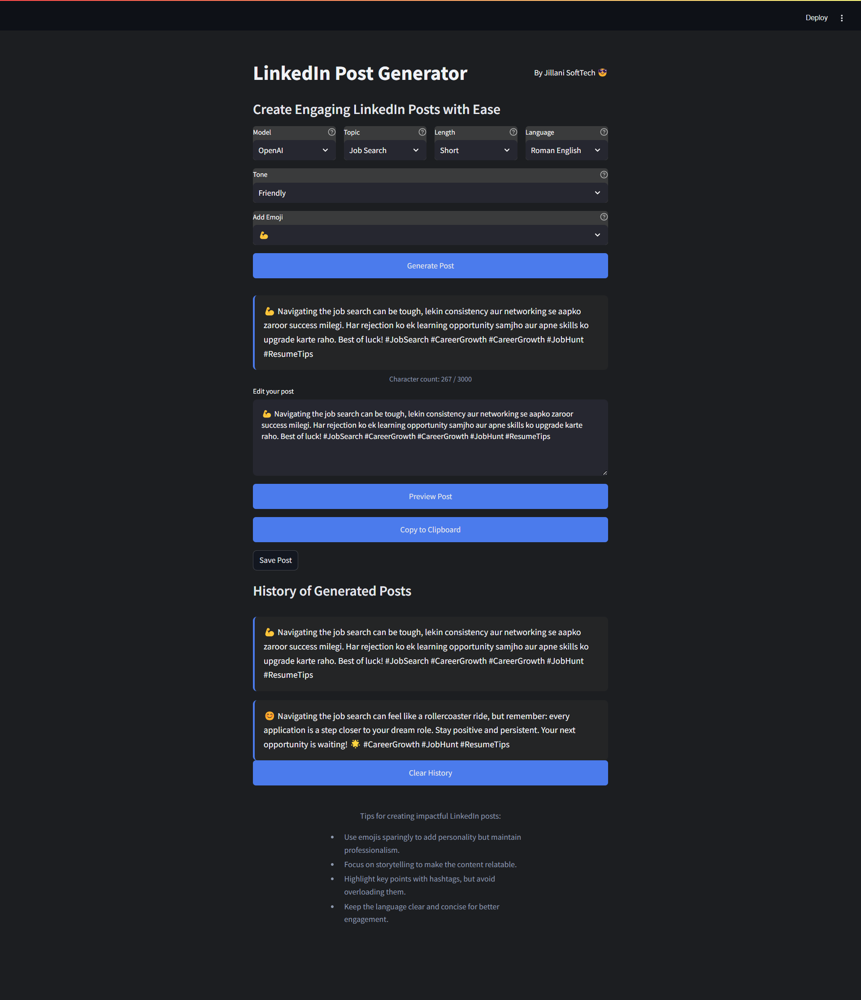

# LinkedIn Post Generator with Generative AI

This tool is designed to help LinkedIn influencers create new posts based on their existing writing style. By analyzing past posts, the tool extracts key topics, tone, and length preferences, allowing users to generate fresh content that aligns with their established style.

<p align="center">
  
</p>

## Overview
Imagine Muhammad Ghulam Jillani, a LinkedIn influencer, seeking assistance to maintain consistency in his posts. With this tool, he can input his previous LinkedIn posts, allowing the system to learn and replicate his unique tone and style. By selecting parameters such as topic, length, language, tone, and even emojis, he can quickly generate new posts that resonate with his audience.

## Features
- **Customizable Post Generation**: Choose from various options, including post length, language (e.g., English, Hinglish), tone, and emoji for a personalized touch.
- **Automatic Hashtag Suggestions**: Receive relevant hashtag suggestions based on the selected topic.
- **Post Editing and Previewing**: Edit generated posts and preview them with reactions to gauge engagement potential.
- **Copy to Clipboard and Save Options**: Easily copy generated posts to the clipboard or save them as text files.
- **Post History**: Review previously generated posts during the session.
- **Clear History**: Remove all stored generated posts with a single click.

## Technical Architecture
<p align="center">
  
</p>

1. **Stage 1: Data Extraction** - Collect LinkedIn posts and extract key details such as topic, language, and length. This data is stored for guiding the language model (LLM) in future generations.
2. **Stage 2: Few-Shot Learning** - Use selected parameters (e.g., topic, language, and length) along with a few past posts to guide the LLM in generating a new post that matches the writing style.

## Setup Instructions

### 1. Prerequisites
- **API Keys**: 
  - **Groq API Key**: Obtain an API key from [Groq Console](https://console.groq.com/keys). Update the `.env` file with this key:
    ```plaintext
    GROQ_API_KEY=your_groq_api_key_here
    ```
  - **OpenAI API Key**: Obtain an API key from [OpenAI](https://platform.openai.com/account/api-keys) if you intend to use OpenAI models. Update the `.env` file with this key:
    ```plaintext
    OPENAI_API_KEY=your_openai_api_key_here
    ```

### 2. Install Dependencies
    Install the necessary Python libraries using:
    ```bash
    pip install -r requirements.txt

### 3. Run the streamlit app:
   ```commandline
   streamlit run main.py
   ```
### Example .env File
    ```
    GROQ_API_KEY=your_groq_api_key_here
    OPENAI_API_KEY=your_openai_api_key_here
    ```
### License and Attribution

Apache License

Copyright (C) Jillani SoftTech. All rights reserved.

Permission is hereby granted, free of charge, to any person obtaining a copy of this software and associated documentation files, to deal in the Software without restriction, including the rights to use, copy, modify, merge, publish, distribute, sublicense, and/or sell copies of the Software, subject to the following conditions:

1. The above copyright notice and this permission notice shall be included in all copies or substantial portions of the Software.
2. Commercial use of this software is prohibited without prior written permission.

